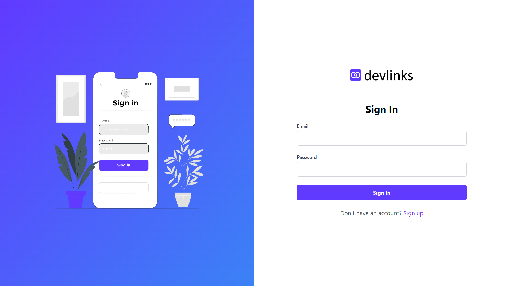
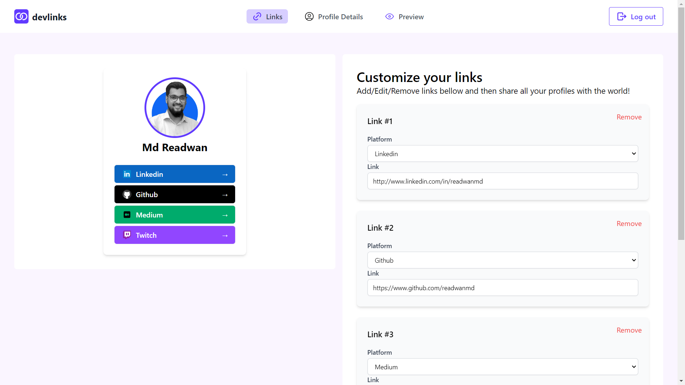
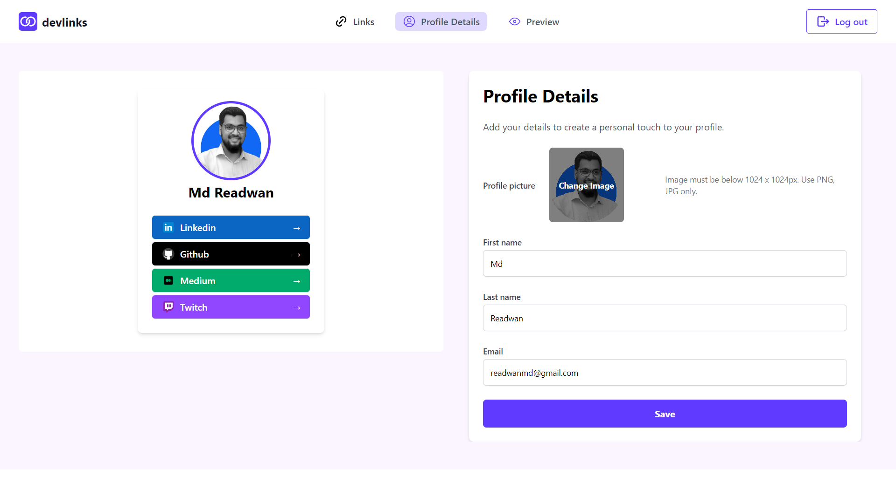
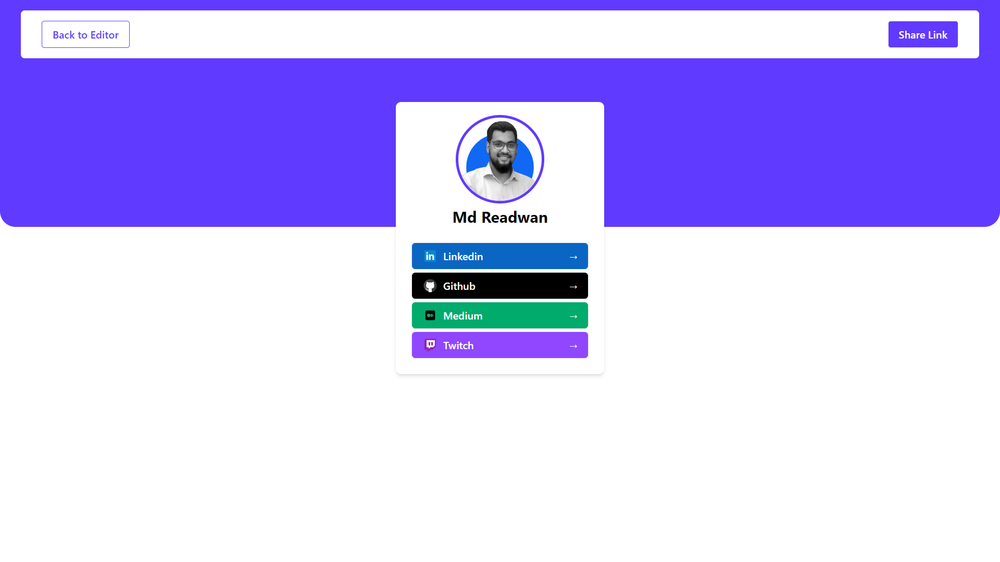
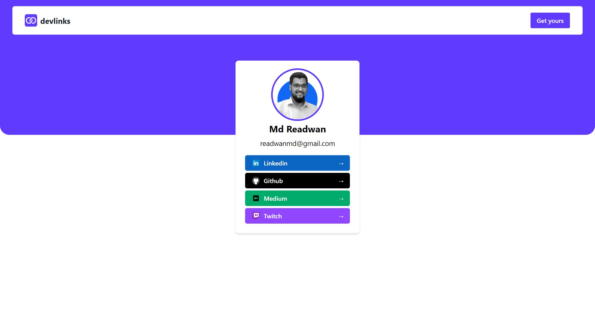

# DevLinks

**DevLinks** is a platform that allows users to manage and share their social media or other personal links in one place. Users can register, log in, and store their links, with options to update or delete them. Each user gets a custom sharable link, where others can view all of their links and visit the respective pages with a single click.

## Features

- **User Registration & Login**: Users can create an account and log in using secure JWT-based authentication.
- **Link Management**: Users can add, update, and delete their social media or other important links.
- **Custom Shareable Profile**: Users get a unique custom URL to share, where all their links are listed.

## Tech Stack

### Backend:

- **Node.js** with **Express.js** for server-side logic.
- **MongoDB** and **Mongoose** for the database.
- **JWT** authentication.

### Frontend:

- **React.js** for building the user interface.

### State Management:

- **Context API** for managing state throughout the application.

## Setup Instructions

### Prerequisites:

- Make sure you have **Node.js** installed. Or, You can download from [here](https://nodejs.org/).
- **Yarn** is recommended as the package manager. If you don’t have it, you can install it globally by running:

```bash
npm install --global yarn
```

### Clone the Repository:

```bash
git clone https://github.com/readwanmd/devlinks.git
cd devlinks
```

### 1. Backend Setup

#### _Remember for local setup you have to install mongodb and mongodb compass on your machine and connection should be opened._

1. Navigate to the `backend` folder:

```bash
cd backend
```

2. Install dependencies:

```bash
yarn
```

3. Create a `.env` file in the `backend` folder and add the following environment variables:

```bash
MONGO_URI=mongodb://127.0.0.1:27017/devlinks
PORT=5000
JWT_SECRET=your_jwt_secret_key
```

4. Start the backend server:

```bash
yarn dev
```

The backend should now be running on `http://localhost:5000`.

### 2. Frontend Setup

1. Navigate to the `frontend` folder in another terminal:

```bash
cd frontend
# from root directory
```

2. Install dependencies:

```bash
yarn
```

3. Create a `.env` file in the `frontend` folder and add the following environment variable:

```bash
VITE_SERVER_BASE_URL='http://localhost:5000/api'
```

4. Start the frontend development server:

```bash
yarn dev
```

The frontend should now be running on `http://localhost:5173`.

### 3. Running Both Servers

To run both the backend and frontend servers together, open two terminals and navigate to the respective directories (`backend` and `frontend`) and run `yarn dev` in the backend and frontend.

## Environment Variables

### Backend (.env file in `backend` folder):

- `MONGO_URI`: MongoDB connection string.
- `PORT`: The port where the backend server will run.
- `JWT_SECRET`: Secret key for signing JWT tokens.

### Frontend (.env file in `frontend` folder):

- `VITE_SERVER_BASE_URL`: The base URL for the API that the frontend will interact with.

# Screenshots


**_Login page_**

**_Links page_**

**_Profile Details page_**

**_Preview page_**

**_Custom link shared page_**
